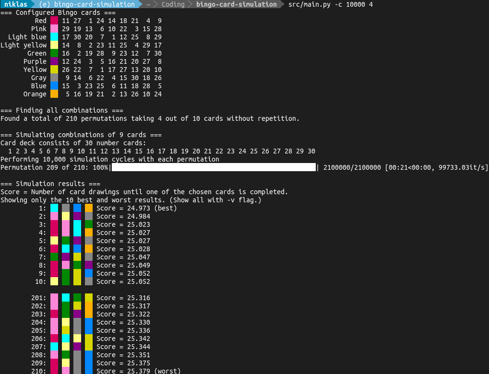

# Bingo Card Simulation

## Objective

It was one of those game evenings with the family when I got curious about how
to increase your winning chances at Bingo by choosing your collection of cards
the most clever way.

Since there are a total of 10 Bingo cards with 9 numbers from 1 to 30 each,
which are distributed evenly, all cards are of equal worth. But when playing
with a set of multiple cards, choosing such ones with duplicate numbers
obviously affects the chance of winning directly, because one number will be
eliminated on more than one card at once. Not a big deal? *Let's find out.*

## Theory

Time for a brute-force algorithm using recursion! :tada:
This program calculates all possible permutations of *n* of the 10 given cards a
player could take and performs 100,000 (configurable) simulated games with this
set of cards. It tracks the total score, i.e. the amount of called numbers
necessary for this set to win, and calculates an average score over all
simulation cycles. Finally, the 10 best and 10 worst card combinations are
printed.

Am I a better Bingo now? Don't know. But be sure that I'll be picking the most
valuable card combinations from now on. :wink:

## Put it into practice

To run the Bingo fortune-teller, simply check out this repository and give it a
try.

```sh
git clone https://github.com/nbe95/bingo-card-simulation.git
cd bingo-card-simulation

python -m venv venv
source ./venv/bin/activate

pip install --upgrade -r ./src/requirements.txt
python ./src/main.py {number of cards to pick}

```

Example run:


